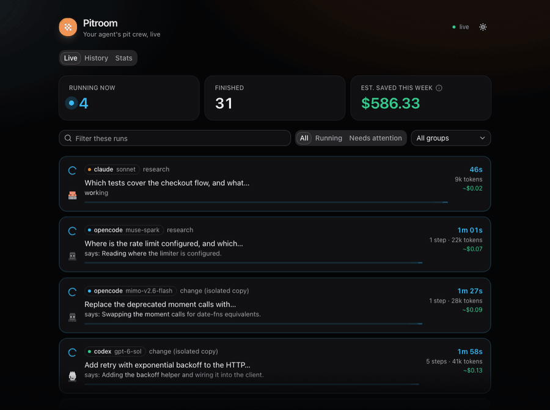
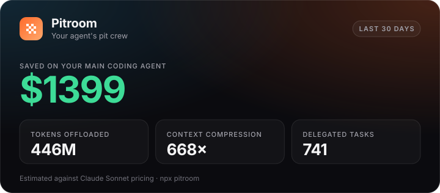
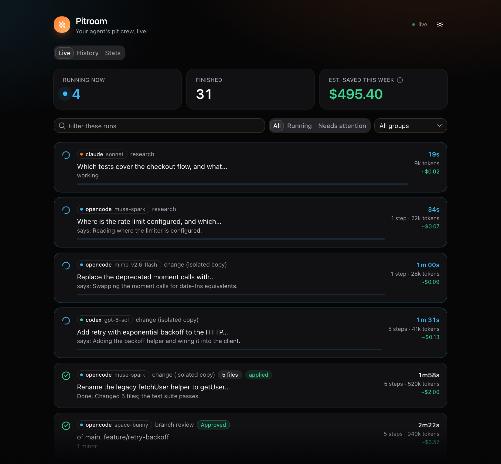
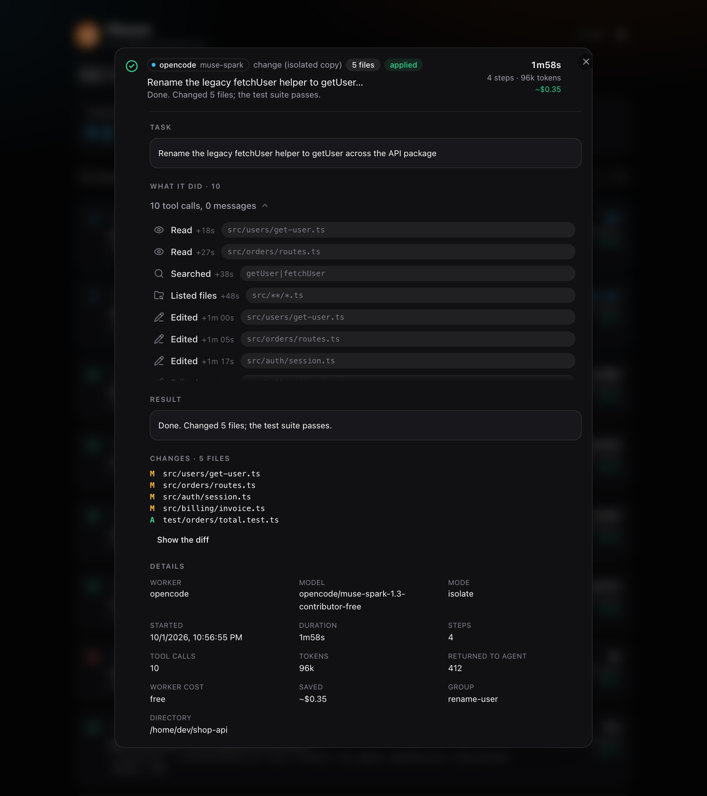
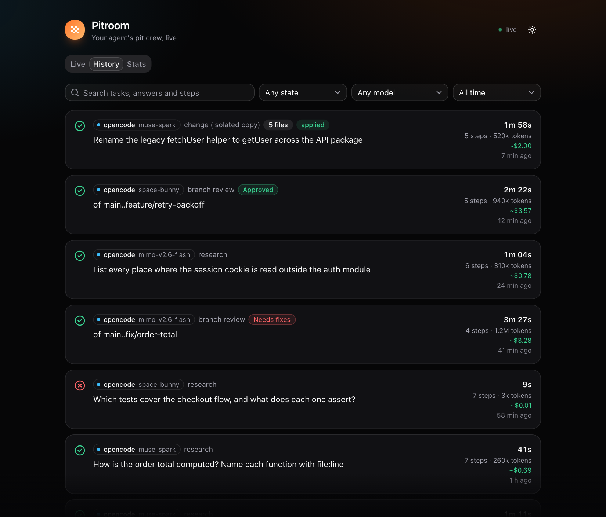
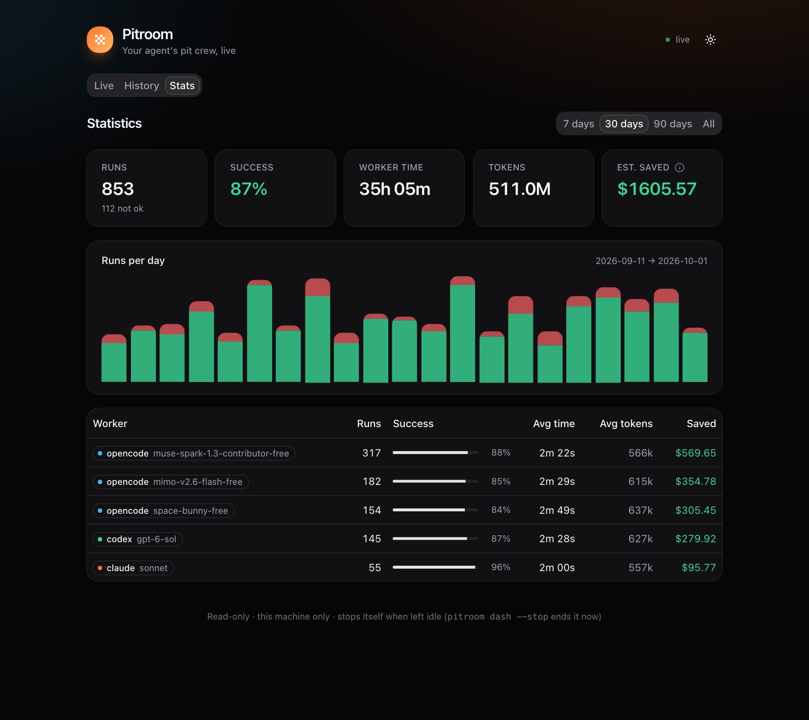
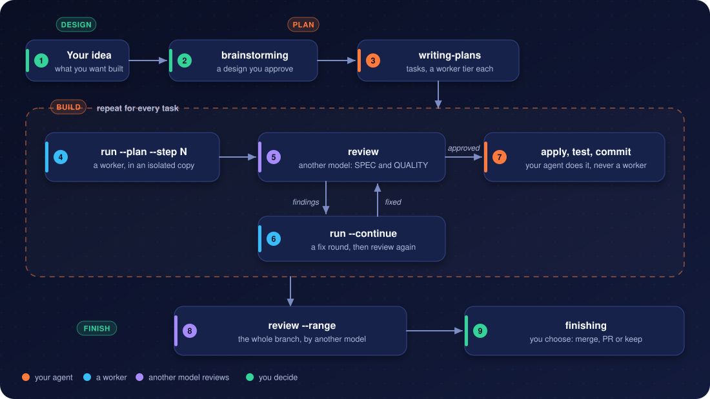
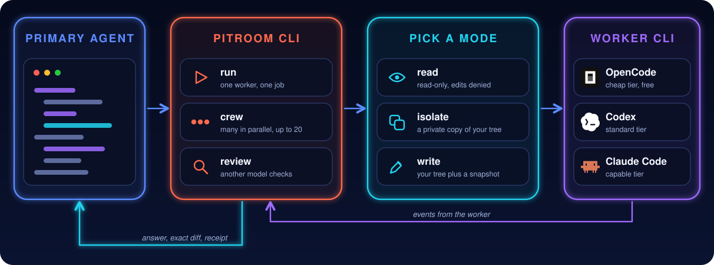

<div align="center">

# Pitroom

### A free pit crew for your expensive coding agent

**Cheaper and faster: hand the reading, fixes, tests and reviews to workers that run in parallel. Keep the decisions.**

Model-agnostic · Verified answers · Receipts, not vibes · OpenCode / Codex / Claude Code workers

<br />

[](https://github.com/ATASTECH/pitroom/releases/latest)
[](https://www.npmjs.com/package/pitroom)
[](https://www.npmjs.com/package/pitroom)
[](https://github.com/ATASTECH/pitroom/stargazers)
[](https://github.com/ATASTECH/pitroom/actions/workflows/ci.yml)
[](LICENSE)

<br />

**[Quick start](#quick-start)** ·
[Dashboard](#dashboard) ·
[Benchmarks](#benchmarks) ·
[Workflow](#workflow) ·
[Skills](#skills) ·
[Commands](#commands) ·
[Workers](#workers) ·
[Responsibility](#responsibility) ·
[Write an adapter](docs/backends.md)

<br />


<br />

**Your agent decides · Cheap workers do the typing · A second model reviews**

<br />



<sub>`pitroom dash`, with sample data</sub>

</div>

---

## Why Pitroom?

Claude Code, Codex and friends spend premium tokens *reading*: grepping, opening files, scanning code they'll never quote.

Pitroom goes one step further:

> **Your agent stays in the driver's seat. A pit crew of cheap workers does the legwork in parallel, while your agent keeps going, and hands back only the answer, the exact diff and a receipt.**

<table>
<tr>

<td width="25%" valign="top">

### Your model, not ours

No model is hardcoded.

Pitroom uses your worker CLI's default model: a free tier, a local MLX/Ollama model or a cheap paid one. Switch there and Pitroom follows.

</td>

<td width="25%" valign="top">

### Any worker CLI

OpenCode, Codex CLI and Claude Code today, Gemini CLI soon.

One group can mix them, and a fallback chain can cross them ([how adapters work](docs/backends.md)).

</td>

<td width="25%" valign="top">

### Verified answers

Every `path:line` a worker cites is checked on disk. A cite without its directory (`ipc.ts:218`, `src/main/ipc.ts:218`) is found in the project, and a call such as `Schema.parse:432` is not mistaken for a file.

Your agent trusts what checks out and skips re-reading it.

</td>

<td width="25%" valign="top">

### Safe by construction

No commit, push, reset or bulk delete. A git guard stops the tricks.

In isolate mode nothing reaches your tree until you apply it.

</td>

</tr>
</table>

### And more

- **Receipts, not vibes.** Tokens the worker burned, tokens returned to your agent, compression ratio, and an estimate of what your primary model would have charged. `pitroom savings --card card.svg` makes a shareable card.
- **Self-healing worker chain.** Free models get rate-limited or retired. List fallback workers once (`fallback`) and a run that hits "model not found", 429 or quota errors moves to the next model automatically. Still no model hardcoded: the chain is yours.
- **A crew, not just one worker.** `pitroom crew` starts several workers at once, `pitroom watch --json` streams one line per change so your agent follows them live, `pitroom wait -g` collects every answer, `pitroom apply -g` lands isolated patches in order. Up to 20 workers run at once by default (`maxParallel`, 30 at most), the rest queue, and the fallback chain absorbs free-tier rate limits; parallel writers are refused.
- **Faster, not only cheaper.** Workers run in the background and side by side (up to 20 at once) while your agent keeps working, so slow reading and review stop blocking it. In the [benchmark](#benchmarks), 470 s of worker time finished in 156 s of wall clock, about 3× faster than one question after another, and your agent's own context stayed small.
- **Free first, dearer only when needed.** Runs and plan tasks start on the `cheap` tier, OpenCode's free model; `standard` (Codex) and `capable` (Claude Code) are for tasks that need them, and an optional `review` tier names who reviews. `pitroom models` shows what each worker offers, the effort levels (`low` … `xhigh`) each model accepts, what you say it costs (`costs`) and what it used; `--effort` sets the level per run. Details: [Models, costs and effort](#models-costs-and-effort).
- **Exact changes, even in a dirty tree.** Pitroom snapshots the working tree with a throwaway git index (your index, branches and stash are never touched), so it reports *only the worker's* edits and can undo exactly those: `pitroom revert <id>`.
- **Your agent sets the permissions.** It creates each worker with the permissions the task and your session allow (read-only, isolated copy, in-place edits, web), and a worker never widens its own. A fixed floor stays for every run: no git history changes, no `sudo`, no publishing, no secrets. A worker cannot land a deletion either: `pitroom apply` refuses a patch that deletes files unless your agent passes `--allow-delete`.
- **Real isolation.** `--isolate` runs the worker in a private copy of your **current** state (its own repository, sharing your objects read-only), uncommitted and untracked files included, then hands you a patch: `pitroom apply <id>` (checked, refuses on conflict) or `pitroom discard <id>`.
- **Zero repo pollution.** No `.pitroom/` folder, no `.gitignore` edits, no branches. Records live in `~/.local/state/pitroom`.
- **Works with any agent.** Fourteen [Agent Skills](https://agentskills.io): the superpowers development workflow run by workers, plus delegation (`using-pitroom`, `pitroom-research`, `-crew`, `-implement`), a CLI, and a Claude Code / Codex plugin whose session-start hook loads the workflow. Claude Code, Codex, Gemini CLI, Cursor, or anything that can run a shell command.
- **A live dashboard and a searchable history.** `pitroom dash` opens a local page of every run (the task, what the worker did step by step, its result and diff) with history and statistics, for the agent apps that show neither hooks nor a status line; `pitroom history` searches everything Pitroom ever ran. See [Dashboard](#dashboard).
- **Small.** About 6,000 lines of TypeScript, a ~190 KB CLI bundle (plus the ~0.7 MB of dashboard files it serves), zero runtime dependencies.

### How it stays safe

Each run gets the worker's own safety mechanism set to the mode (for OpenCode, a permission profile injected through `OPENCODE_CONFIG_CONTENT`): no commit/push/reset/checkout/stash/clean/rebase, no bulk deletes, no `sudo`, a file-reading tool that refuses `.env` and key files (OpenCode and Claude Code workers), no web tools unless you pass `--web`, no subagents, no recursive delegation. Only `allow`/`deny` rules, so a headless run never stalls on a prompt. A **git guard** on the worker's PATH also stops `sh -c "git push"`, `env git reset`, aliases and scripts from committing, pushing, resetting, stashing or touching your index. Your `opencode.json` is never touched. These safeguards reduce risk; they are not a security boundary (see [Responsibility](#responsibility) and [SECURITY.md](SECURITY.md)).

---

## See it work

A real run on a free OpenCode Zen model: your agent reads ~554 tokens instead of 163,000.

```text
$ pitroom run "Which function builds the read-only permission profile, and which bash commands does it allow?"
pitroom ✔ done · read · 30s · run 20260930-003902-3270
session ses_… · model opencode/muse-spark-1.3-contributor-free

SUMMARY: The read-only permission profile is built by `readProfile()` in src/profiles.ts:89.
Its bash allow-list is `READ_ONLY_BASH` in src/profiles.ts:29-46.
DETAILS:
- Allowed (src/profiles.ts:31-41): `git status*`:31, `git diff*`:32, … `rg *`:40, `wc *`:41.
- Explicit sub-denies: `rg *--pre*`:43, `git *--output*`:44, `git *--ext-diff*`:45.
FILES CHANGED: none

── receipt: worker processed 163k tokens in 6 steps (7 tool calls) · worker cost $0.000
   · returned ~554 tokens, 294× compression · est. saved $0.152 vs Claude Sonnet
```

Every run prints a receipt, and `pitroom savings` adds them up (`--card` writes this shareable card; the numbers here are sample data, and a real measurement follows in [Benchmarks](#benchmarks)):

<p align="center"></p>

---

## Dashboard

`pitroom dash --detach` prints the address of a live page on `127.0.0.1` (read-only, this machine only). It is for the places where hook messages and status lines do not reach, such as the Claude Code and Codex apps: open it in a browser or in the app's own browser pane. The skills tell your agent to start it and give you the address when it runs workers in the background.

The screenshots below show sample data (an imaginary `shop-api` project), not a real one.

**Live.** What is running now, and the latest runs. Running cards show a timer, the worker's last words and its animated pixel mascot (a finished card shows the worker's logo); finished ones show the result and, for reviews, the findings.

<p align="center"></p>

**Click a card and it grows into a panel** with the task, what the worker did step by step (files read, searches, commands, edits, with times, failed ones marked), its result, the files and diff it changed, and the details (model, tokens, cost, fallbacks, reference check).

<p align="center"></p>

**History** searches everything Pitroom ever ran (the full text of tasks, answers and steps), with filters by state, model and period; each run opens as the same card as on Live. **Stats** shows runs, success rate, time, tokens and savings, per worker and model and per day.

<p align="center"> </p>

The dashboard is a React app built once into `dist/ui` and served as two static files, so the CLI still has no runtime dependencies. It follows your system's light or dark theme (a button switches it).

---

## Benchmarks

Measured on a real, public repository: [PI-Desktop](https://github.com/vastsa/PI-Desktop) at commit `c2bfe35`, 2,349 tracked files and about 419,000 lines of TypeScript and Rust. Eight questions of the kind an agent asks before it changes code, run as one read-only crew (`pitroom crew`, at most four workers at a time) on OpenCode's free `muse-spark-1.3-contributor-free` model.

| Question | Worker time | Tokens processed | Returned to the agent | Compression | Refs verified |
|---|---|---|---|---|---|
| Where is the plugin runtime, and which functions activate and deactivate a plugin? | 37 s | 405,380 | 767 | 529× | 10/11 |
| When does the agent runtime compact a conversation? (function and exact condition) | 90 s | 1,250,719 | 763 | 1,639× | 17/17 |
| Where is session state persisted to disk in the Rust host? | 71 s | 854,969 | 1,426 | 600× | 29/45 ¹ |
| Which IPC channels expose window management to the renderer? | 32 s | 165,180 | 716 | 231× | 3/28 ¹ |
| How does a tool call travel from the agent runtime to the Rust host? | 119 s | 1,818,524 | 866 | 2,100× | 14/15 |
| Which packages and apps depend on the i18n package? | 33 s | 271,297 | 656 | 414× | 15/16 |
| Where is auto-update implemented, and what does the Windows portable target change? | 29 s | 215,693 | 743 | 290× | 20/21 |
| Which tests cover the RPC layer? | 59 s | 511,209 | 1,747 | 293× | 6/7 |
| **All eight** | **156 s** wall clock | **5,492,971** | **7,684** | **715×** | 114/160 |

Workers read 5.5 million tokens of code and docs (96 steps, 179 tool calls) and handed the agent 7,684 tokens, about 960 per answer. The eight runs add up to 470 s of worker time but finished in 156 s of wall clock, because four ran at a time (the limit then; the default is now 20): about 3× faster than one after another. That compares the same workers with themselves, not with your agent doing the reading alone, which I did not measure. `pitroom savings` estimates $3.86 saved for these eight at Claude Sonnet list prices.

**Were the answers right?** Checked by hand against the repository: 46 key claims across all eight answers (the cited line and what it says) were all correct, and two completeness checks held (exactly 6 invoke and 3 event window channels; no tests in `config_sync_rpc.rs`). The i18n answer lists the 12 source files that import the package and leaves out 11 test and fixture files that do too, which the question did not ask about. Pitroom's own checker marks fewer references as verified than that: ¹ those two answers cite bare file names (`transcripts.rs:651`) that it cannot resolve to a path, and it counts them as unverified although the lines are right.

**A change in an isolated copy:** "add a one-line comment above `resolveUpdateMode`" finished in 16 s and 4 steps (142,491 tokens). The patch was one file and one line, the comment matched the code, and your working tree is untouched until you apply.

**Free models against `gpt-6-sol`, on three large repositories.** The same kind of work on React (7,252 files), Django (7,091) and Kubernetes (31,353 files), at pinned commits. Nine bounded questions, three per repository: the file and line that define a function, how many files contain a word, and which files contain it. Every answer is checked against `git grep`, not by opinion: an exact `path:line` (half a point for the right file on the wrong line), an exact count, and for the lists an F1 score that punishes both missed and invented files. Each worker ran the nine questions once, read-only, with no fallback, so a model that cannot do it fails instead of being swapped for another.

| Worker and model | Score | Median time | Median tokens |
|---|---|---|---|
| Codex `gpt-6-sol` (effort medium) | **100%** | 16 s | 50k |
| Codex `gpt-6-sol` (effort low) | **100%** | 20 s | 50k |
| OpenCode `muse-spark-1.3-contributor-free` | **100%** | 23 s | 44k |
| OpenCode `space-bunny-free` | **100%** | 35 s | 63k |
| OpenCode `mimo-v2.6-flash-free` | **100%** | 37 s | 42k |
| OpenCode `big-pickle` | **100%** | 42 s | 91k |
| OpenRouter `nemotron-3-ultra-550b-a55b:free` | 89% | 27 s | 42k |
| OpenCode `longcat-2.5-preview-free` | 89% | 29 s | 20k |
| OpenCode `nemotron-3-ultra-free` | 89% | 35 s | 21k |
| OpenRouter `inkling:free` | 83% | 14 s | 41k |
| OpenCode `nemotron-3.5-lightning-free` | 72% | 377 s | 69k |
| NVIDIA `gpt-oss-20b` (7 questions) | 57% | 24 s | 42k |

Four free models matched `gpt-6-sol` on these questions. Every model found every definition; the misses are count questions (a wrong number) and, for two models, list questions, one of them by adding `docs/` files that are not under `django/`. `gpt-6-sol` was as fast as the quickest free models, and lowering its effort did not cost accuracy here. `nemotron-3.5-lightning-free` wrote an unrelated text for one list question and ran into the 10-minute limit on another. The scoring harness and every raw answer are in [`benchmarks/multi-repo`](benchmarks/multi-repo).

Only workers that ran are in the table. Models that could not answer at all (a provider error, or the shared daily quota of OpenRouter's free tier) are left out, and so are the two `gpt-oss-20b` runs that ended in a provider error; a timeout is kept.

**Does a review find a planted bug?** A bug was changed into real code (an inverted check, a swapped `&&`/`||`, a flipped `return`) in React, Django, Kubernetes and Pitroom itself, committed as a bare "tidy", and `pitroom review` was asked to review the commit. 29 packages (14 with the bug alone, 15 with the bug and three comment-only edits around it). A review counts as a find when a Critical or Important finding names the changed file and either cites a line within 5 or names the changed identifier or its function; "exact line" is the strict version (within 3).

| Worker and model | Bug found | Exact line | Reviews | Mean time | Slowest |
|---|---|---|---|---|---|
| OpenCode `space-bunny-free` | 100% | 100% | 29 of 29 | 2 min 19 s | 5 min 46 s |
| OpenCode `nemotron-3-ultra-free` | 97% | 79% | 29 of 29 | 1 min 45 s | 3 min 29 s |
| OpenCode `longcat-2.5-preview-free` | 83% | 83% | 29 of 29 | 2 min 53 s | 8 min (1 timed out) |
| Codex `gpt-6-sol` | 100% | 100% | 9 of 29 | 38 s | 52 s |
| OpenCode `muse-spark-1.3-contributor-free` | 100% | 57% | 14 of 29 | 48 s | 2 min 0 s |
| OpenCode `big-pickle` | 100% | 92% | 13 of 29 | 2 min 28 s | 5 min 27 s |
| OpenCode `mimo-v2.6-flash-free` | 100% | 100% | 10 of 29 | 4 min 6 s | 7 min 40 s |

Almost every model found almost every bug, so this test separates them on speed and precision, not on whether they can review: `muse-spark` described the right bug but often quoted a wrong line number (57% exact), and `gpt-6-sol` and `muse-spark` were the fastest by a wide margin. Only three models finished all 29: the other four are scored on the reviews that ran before a provider limit (the free tier's usage limit, and the Codex plan's, which `gpt-6-sol` reached), and the rest are left out, not counted as misses, so their rows rest on 9 to 14 reviews. Every change is only 2 to 5 lines, which is easy; there is no false-alarm rate (the comment-only "clean" packages turned out to contain comments that were really wrong, so they cannot show one); and React, Django and Kubernetes may be in a model's training data. The harness and every raw review are in [`benchmarks/review-bugs`](benchmarks/review-bugs).

**What this does not show**
- One run per question and model: there is no variance here. The questions are bounded lookups that `grep` can answer, so they do not show how a model handles design questions or large edits, and four free models and `gpt-6-sol` all scoring 100% says the test is easy at the top, not that they are equal.
- An open-ended task ("find up to five spelling mistakes in `docs/`") did not finish: it was stopped after 19 minutes and 57 tool calls. Give workers bounded tasks.
- "Tokens processed" is what the workers read and wrote. What your agent would have spent doing the same reading itself is an estimate, not a measurement: the savings figure assumes it would process about the same tokens. The $0 worker cost is because the model is free.
- The hand check covered key claims, not every citation.

To repeat it on your own repository: `pitroom crew -d <repo> -g bench "<question 1>" "<question 2>" …`, then `pitroom wait -g bench`, `pitroom show <run>` and `pitroom savings --models`.

---

## Quick start

You need Node.js 22.13+ and at least one worker CLI: [OpenCode](https://opencode.ai) v2+ (the default worker, with free models), [Codex CLI](https://github.com/openai/codex) or [Claude Code](https://claude.com/claude-code).

### 1. Install: pick your agent

**Claude Code**

```bash
claude plugin marketplace add ATASTECH/pitroom
claude plugin install pitroom@pitroom
```

<sub>Inside a session: `/plugin marketplace add ATASTECH/pitroom`, then `/plugin install pitroom@pitroom`.</sub>

**Codex**

```bash
codex plugin marketplace add ATASTECH/pitroom
codex plugin add pitroom@pitroom
npm i -g pitroom
```

**Any other agent (Cursor, Gemini CLI, a plain shell) or just the CLI**

```bash
npm i -g pitroom
pitroom install
```

| Path | You get |
|---|---|
| Claude Code plugin | The 14 skills, the session-start hook that introduces Pitroom, and a card after each `pitroom` command. |
| Codex plugin | The 14 skills. Codex has no session-start hook, so Pitroom is not introduced on its own: the skills load when a task matches, or name one. `pitroom` itself comes from npm. |
| npm + `pitroom install` | The CLI, and the skills linked into `~/.agents/skills` and `~/.claude/skills`. |

Pick one path, not several: `doctor` warns if the skills load twice. The plugins alone do not put `pitroom` on your PATH, so install it from npm too if you want to run it yourself (`watch`, `models`, `savings`, the status line).

### 2. Check the setup

```bash
pitroom doctor --probe
```

It checks the worker CLIs, models, permissions and skills, and runs one live round trip.

### 3. Use it

Pitroom is a toolbox, not a procedure: your agent uses it when it helps, or you ask explicitly:

> Use pitroom to map how sessions are created and invalidated, then propose a fix.
> Split this into a pitroom crew: audit auth, billing and uploads for missing input validation.

Or start a worker yourself and read its receipt:

```bash
pitroom "Which files read the session cookie? Cite file:line."
pitroom savings          # what all your runs saved so far
pitroom models           # what each worker offers, what it costs you, what it used
```

<details>
<summary>Update and uninstall</summary>

```bash
# update
claude plugin update pitroom@pitroom
codex plugin marketplace upgrade pitroom
npm i -g pitroom@latest

# uninstall
claude plugin uninstall pitroom@pitroom
codex plugin remove pitroom@pitroom
pitroom uninstall && npm rm -g pitroom
```

</details>

---

## Modes

| | Flag | For | Your working tree |
|---|---|---|---|
| **read** | *(default)* | research, locating code, reviews | untouched; edit tools are denied |
| **isolate** | `-i` | code changes you want to review first | untouched until `pitroom apply` |
| **write** | `-w` | quick in-place edits | edited now; `pitroom revert` undoes exactly |

```bash
pitroom run "Find every place we build SQL strings by hand; file:line and risk"
pitroom run -i --link node_modules --verify "npm test" "Fix the off-by-one in paginate() and add a test"
pitroom run -w "Rename getUserById to findUserById in src/ and fix imports"
pitroom run --continue last "Now handle the empty-page case too"
```

Long jobs: `--bg` returns immediately; `pitroom wait <id>` blocks for up to 9 minutes (made for agents with 10-minute tool limits; exit code 75 means "call wait again").

---

## Workflow

Pitroom ships a full development methodology as skills, adapted from [superpowers](https://github.com/obra/superpowers) so that its subagents are cheap workers: your agent brainstorms and plans with you, then executes the plan task by task while workers do the typing and a second model does the reviewing.

<p align="center"></p>

| Step | Skill | Command |
|---|---|---|
| Design | `pitroom-brainstorming` | writes the spec to `docs/pitroom/specs/` |
| Plan | `pitroom-writing-plans` | writes the plan to `docs/pitroom/plans/`, a worker tier on every task |
| Implement | `pitroom-driven-development` | `pitroom run -i --plan PLAN --step N` |
| Review | `pitroom-review` | `pitroom review <run>` (a read-only reviewer on another model) |
| Fix | `pitroom-receiving-review` | `pitroom run --continue <run> "…"` (the re-review sees only the fix) |
| Land | `pitroom-driven-development` | `pitroom apply <run>`, your tests, your commit |
| Branch review | `pitroom-review` | `pitroom review --range main..HEAD --plan PLAN` |
| Finish | `pitroom-finishing` | merge, pull request or keep: asked, never automatic |

A review package holds the diff under review with 10 lines of context, and the reviewer's CLI sends it to that worker's model provider. Pitroom does not filter it: secrets committed in a reviewed range go along as they are.

Tiers map plan tasks to workers: `"tiers": {"cheap": "opencode", "standard": "codex", "capable": "claude"}`. `pitroom plan status PLAN` rebuilds where a plan stands from the run records (it survives context compaction), and `pitroom plan note` keeps completions and rulings outside the repo.

---

## Crews

A real crew over this repository, four questions at once on a free OpenCode Zen model:

```bash
pitroom crew -g v04-demo \
  "Where does Pitroom enforce the maxParallel queue, and how does a waiting run react to pitroom stop? Cite file:line." \
  "How does the git guard shim resolve git aliases? Cite file:line." \
  "Which fields of OpenCode v2 events does the parser read for token usage, refused tool calls and errors? Cite file:line." \
  "How does pitroom apply -g decide which patches to apply and in what order? Cite file:line."
pitroom watch -g v04-demo --json   # what the primary agent follows, one line per change:
```

<details>
<summary>What the crew prints: the stream your agent follows and the status table</summary>

```text
{"event":"started","run":"20260930-102812-a65d","mode":"read","task":"Where does Pitroom enforce the maxParallel queue, and how d…"}
{"event":"progress","run":"20260930-102812-a65d","steps":3,"tools":4,"last":"grep SIGINT|SIGTERM|stop.*queued|stopped.*queued"}
{"event":"done","run":"20260930-102812-a563","time":"21s","worker":"opencode (default model)","summary":"The shim resolves `alias.<sub>` via `real git config --get` in a loop …","refs":"5/5"}
{"event":"all-done","runs":4,"ok":4,"failed":0}
```

```text
$ pitroom status -g v04-demo
RUN                   STATE  MODE  TIME  STEPS  WORKER                    NOW / RESULT
20260930-102812-0c0d  done   read  30s   5      opencode (default model)  Parser `src/backends/opencode/events.ts` reads …
20260930-102812-7642  done   read  27s   5      opencode (default model)  `pitroom apply -g NAME` applies finished isolat…
20260930-102812-a563  done   read  21s   2      opencode (default model)  The shim resolves `alias.<sub>` via `real git c…
20260930-102812-a65d  done   read  39s   7      opencode (default model)  maxParallel is enforced by file-based slots (`s…
```

</details>

Humans get the same table live with `pitroom watch -g NAME`; `pitroom wait -g NAME --brief` prints one line per worker, `pitroom show <run>` the full answer.

For changes, `pitroom crew -i …` gives every worker its own isolated copy of your current state and `pitroom apply -g NAME` lands the patches in order, stopping at the first conflict. Up to `maxParallel` workers (default 20, at most 30) run at once, the rest queue; only one `--write` run per repository is allowed. `pitroom stop -g NAME` stops running and queued workers.

---

## Skills

| Skill | Your agent uses it to |
|---|---|
| `using-pitroom` | see what Pitroom offers and when it pays off (injected at session start by the plugin; optional) |
| `pitroom-brainstorming` | turn an idea into an approved design before any code |
| `pitroom-writing-plans` | write a task-by-task plan with a worker tier per task |
| `pitroom-driven-development` | execute a plan: worker per task, review on another model, fix loop, apply, commit |
| `pitroom-worktrees` | isolate its own branch for the work |
| `pitroom-tdd` | test first, for itself and the workers it briefs |
| `pitroom-debugging` | find root causes, with workers gathering the evidence |
| `pitroom-verification` | run the checks before claiming anything is done |
| `pitroom-review` | get a change, a fix round, a branch or a PR reviewed by another model |
| `pitroom-receiving-review` | weigh review findings with technical rigor |
| `pitroom-finishing` | merge, open a PR or keep the branch, as the user chooses |
| `pitroom-research` | find, map or explain code through a read-only worker |
| `pitroom-implement` | get a one-off change made in an isolated copy |
| `pitroom-crew` | split independent work across parallel workers and merge the results |

---

## Commands

<details>
<summary>All commands and exit codes</summary>

```text
pitroom run [-r|-w|-i] [-W WORKER] [-m MODEL] [-d DIR] [-f FILE]… [-t 30m] [--verify CMD] [--link a,b] [--bg] "task"
pitroom run --continue <run|last> "follow-up"
pitroom crew [-i] [-g NAME] "task 1" "task 2" …   (or --task-file with --- separators)
pitroom run -i --plan PLAN --step N [--tier T] ["notes"]
pitroom review [run | --range A..B [--plan PLAN]] [--tier T | -W T] [--bg]
pitroom plan status PLAN [--json] · pitroom plan note PLAN "Task N: …"
pitroom status|wait|watch [run… | -g NAME]        wait: --any --brief --timeout · watch: --json|--brief --interval
pitroom dash [--detach] [--port N] [--open] [--stop]   a live page of the runs on 127.0.0.1
pitroom history [TEXT] [--model M] [--state S] [--since 30d] [--limit N] [--json]   finished runs, searchable
pitroom history stats [--since 30d] · pitroom history import   per worker and model · take in older runs
pitroom show [run]                                --patch --events --full --json
pitroom apply [run | -g NAME] · pitroom discard|revert [run] · pitroom stop [run | -g NAME]
pitroom ls [--running] [-g NAME] · pitroom clean [--days 14] [--yes]
pitroom savings [--since 7d|30d|all] [--models] [--card file.svg] [--badge]
pitroom models [worker] [--all] [--json]      models, effort levels, your costs, your usage
pitroom statusline [--then CMD] · pitroom hook-card
pitroom doctor [--probe] · pitroom config · pitroom install [--copy] [--force] · pitroom uninstall
```

Exit codes: `0` ok · `1` worker failed · `2` usage · `3` refused/setup · `4` timeout · `5` read-only violation · `6` verify failed · `75` still running.

</details>

### History

Every finished run is also written to a SQLite database (`history.db` in Pitroom's state directory; Node's built-in `node:sqlite`, nothing to install). It keeps the task, worker and model, time, tokens, savings, the steps the worker took, its answer and the diff, and it is searchable:

```bash
pitroom history "login bug"            # full-text search over the task, the answer and the steps
pitroom history --state problem --since 7d
pitroom history stats --since 30d      # runs, success rate, average time and tokens per worker and model
```

While a run runs, its raw event stream is a plain file (the simplest thing that survives a crash). When it ends, the stream is compressed, and the stderr log is kept only for runs that did not succeed. `pitroom clean` removes old run directories but the history keeps them: `pitroom show <run>` still prints their report, steps, and patch. Runs from before the history existed are taken in by `pitroom history import` (it also runs on the first `pitroom history` and `pitroom dash`). The files remain the source: the database can be deleted and rebuilt with `history import` for the runs still on disk.

### Seeing Pitroom at work

Two settings make every delegation visible, whether or not the agent mentions it. A status line shows running workers and this week's savings (`--then` keeps your own status line first); a card appears after each `pitroom` command the agent runs, once per phase (started, finished with its result, applied). The plugin registers the card hook itself; with `pitroom install`, add both to `~/.claude/settings.json`:

```json
{
  "statusLine": { "type": "command", "command": "pitroom statusline --then 'your-own-statusline'" },
  "hooks": {
    "PostToolUse": [{ "matcher": "Bash", "hooks": [{ "type": "command", "command": "pitroom hook-card", "timeout": 10 }] }]
  }
}
```

The Claude Code and Codex **apps** show neither hook messages nor a status line. For them there are two things that need no setup:

- `pitroom dash --detach` prints the address of a live dashboard with three tabs: **Live** (every running and recent run as an animated card; click one for the task, what the worker did step by step, its result, the diff and the details), **History** (search and filter everything Pitroom ever ran; every run opens as the same card) and **Stats** (success rate, time, tokens and savings per worker and model). It is read-only, listens on `127.0.0.1` only and stops itself after an hour without a request (`pitroom dash --stop` ends it sooner). Open it in a browser or in the app's own browser pane. The skills tell the agent to start it and give you the address when it runs workers in the background.
- `pitroom watch -g NAME --brief` prints one card line when a worker starts and one when it ends. In Claude Code, the agent runs it through the Monitor tool and the lines appear in the app; in Codex the command's output block fills as it goes.

---

## How it works

<p align="center"></p>

<details>
<summary>Headless problems Pitroom handles for every worker</summary>

Handled for every worker: `opencode run` blocks forever on an open stdin pipe; `ask` permissions stall headless runs; default output carries ANSI and banners; and in OpenCode v2 a plain `run` attaches to the shared background service, where per-run permissions and the git guard would not apply. Pitroom closes stdin, uses allow/deny-only profiles, parses `--format json` and always runs a private `--standalone` server.

</details>

---

## Workers

A worker is named by a target: `backend[:model]`.

```bash
pitroom run "…"                                          # preferred worker (config "worker", default opencode)
pitroom run -W opencode:opencode/space-bunny-free "…"    # a specific backend and model
pitroom run -W 'codex:#low' "…"                          # the model from config "models" (not Codex's default), low reasoning effort
pitroom run --effort high "…"                           # any worker: model#level (Codex, Claude Code, OpenCode)
pitroom run -W claude:haiku "…"                          # Claude Code on a cheap model
pitroom run -m nvidia/z-ai/glm-5.3 "…"                   # another model on the preferred worker
```

| Worker | Status | Read-only enforced by | Cost in receipts | Notes |
|---|---|---|---|---|
| OpenCode (v2+) | ✅ | per-run permission rules | reported | private `--standalone` server per run |
| Codex CLI | ✅ | OS sandbox (`read-only` / `workspace-write`) | tokens only | `codex login`; your `~/.codex/config.toml` is ignored for workers (its MCP servers run outside the sandbox); models take `#effort` |
| Claude Code | ✅ | tool allowlist (`--restricted --safe-mode`, `dontAsk`) | reported | `claude auth login`; its default is often Opus, so prefer `-W claude:haiku` |
| Gemini CLI | soon | approval mode + policy engine | | |

### Models, costs and effort

`pitroom models` lists what each worker offers (Codex from its own model cache, Claude Code's aliases, OpenCode's `opencode models`), the reasoning-effort levels each model accepts, what you say it costs and what your own runs used:

```text
worker  model        effort (* default)                 cost  runs  avg tokens  $/run   in use
codex   gpt-6.1-sol  low*/medium/high/xhigh/max/ultra   2     20    174k        -       tier standard
codex   gpt-6-sol    low/medium*/high/xhigh/max/ultra   1     1     24k         -       -
claude  haiku        low/medium/high/xhigh/max          ?     -     -           -       -
```

Pitroom cannot know vendor prices and does not fetch them, so a cost is what you enter: `"costs": {"codex:gpt-6-sol": 1, "codex:gpt-6.1-sol": 2}` in the config, in any unit (they are only compared). `pitroom doctor` then prints the cost of the models in use and says when you priced a cheaper one of the same worker. A target that names only an effort (`codex:#low`) uses the model from `models`; a Codex or Claude Code worker with no pinned model gets a warning, because it would run the vendor's own default, which can change and cost more. `--effort LEVEL` sets the level for one run; your agent picks model and level from `pitroom models` (cheapest that fits: `low` for lookups, `medium` for ordinary changes, `high` for reviews).

Fallbacks cross backends (e.g. `"fallback": ["codex:#low", "opencode"]`): a worker that is rate-limited, logged out or missing its model hands the task to the next. Follow-ups (`--continue`) always stay on the worker that owns the session. Writing an adapter: [docs/backends.md](docs/backends.md).

---

## Configuration

<details>
<summary>Environment variables</summary>

| Env | Default | |
|---|---|---|
| `PITROOM_WORKER` | `opencode` | Preferred worker target: `backend[:model]` |
| `PITROOM_MODEL` | the worker's default | Model for the preferred worker |
| `PITROOM_FALLBACK` | none | Comma-separated targets to fail over to on model/provider errors |
| `PITROOM_TIMEOUT` | `30m` | Per-run timeout |
| `PITROOM_MAX_PARALLEL` | `20` | Workers running at once (at most 30); more queue |
| `PITROOM_PRIMARY` | `sonnet` | Pricing preset for the savings estimate: `sonnet`, `opus`, `haiku`, `gpt-5` |
| `PITROOM_PRICE` | | Custom primary price, USD per 1M tokens: `"in,out[,cachedIn]"` |
| `PITROOM_HOME` | `~/.local/state/pitroom` | Where run records and the ledger live |
| `PITROOM_NO_SECRET_WARNING` | | Set to `1` to stop the warning about `.env` files and private keys in the worker's directory |
| `PITROOM_<WORKER>_BIN` | on PATH | Path to a worker CLI, e.g. `PITROOM_OPENCODE_BIN` |

</details>

Or put defaults in `~/.config/pitroom/config.json` (flags and env still win); `pitroom config` shows every effective value and where it came from. `models` gives each worker a default model for targets that name none (`-W codex`, a `"codex"` fallback); a model in the target or `-m` still wins. `tiers` names workers for `--tier` and for plan tasks' `**Worker:**` lines:

```json
{
  "worker": "opencode",
  "fallback": ["opencode:opencode/space-bunny-free", "codex"],
  "models": { "codex": "gpt-6.1-sol", "claude": "claude-sonnet-5-5" },
  "costs": { "codex:gpt-6-sol": 1, "codex:gpt-6.1-sol": 2 },
  "tiers": { "cheap": "opencode", "standard": "codex", "capable": "claude", "review": "opencode:opencode/space-bunny-free" },
  "timeout": "20m",
  "primary": "opus",
  "link": ["node_modules"],
  "maxParallel": 20
}
```

- `worker` and `fallback`: who runs a task when you name no one, and who takes over when it fails; `models`: the model each worker uses when a target names none.
- `tiers`: `cheap`, `standard` and `capable` name the workers for plan tasks and `--tier`; an optional `review` tier names who reviews a run (by default another worker than the implementer's, `standard` first).
- `costs`: your relative cost per `worker:model`, only compared with each other; `maxParallel`: workers at once (default 20, at most 30).


---

## FAQ

**Where does my code go?** To whichever provider your worker's model uses. For private code, point the worker at a local model. The file-reading tools of OpenCode and Claude Code workers refuse `.env` files and private keys; Codex workers are not restricted that way and a shell command can still read them, so keep secrets out of the folder you delegate in.

**How is "saved" computed?** It assumes your primary agent would have processed about the same tokens the worker did, priced at your primary's list prices (`PITROOM_PRIMARY` / `PITROOM_PRICE`), minus the worker's cost and the cost of reading the report. It is an estimate and is labelled as one.

**Can the worker break my repo?** It can't touch git history, refs or your index (permission profile + git guard), can't run bulk deletes, and write-mode edits are revertible with one command. The guard is not an OS sandbox: git called by absolute path from inside a script, or non-git tools, are outside its reach, which is why `--isolate` exists: nothing reaches your tree until you apply it.

**Can the worker read my `.env`?** In the directory it runs in, yes: its prompt says not to, and nothing stops it, and a free model may be hosted by a third party. Pitroom warns when it sees `.env` files, private keys or `credentials.json` there (`PITROOM_NO_SECRET_WARNING=1` silences it). An isolated copy (`-i`) leaves out git-ignored files, so a git-ignored `.env` is not in it; a clean checkout is the safest place for a first try.

**What if the worker fails?** Pitroom exits non-zero with the real cause (for example a default model that no longer exists) and your agent simply continues on its own. `pitroom doctor` diagnoses setup problems.

---

## Responsibility

Pitroom is provided as is, under the [MIT License](LICENSE), and is an independent project: it is not affiliated with or endorsed by OpenAI, Anthropic, OpenCode or the other tools it can drive.

**You are responsible for how you use it.** You decide what you delegate and to which model provider, which permissions a worker gets, and what you apply to your projects. Workers are AI agents and can be wrong: review their changes and run your tests before you rely on them. Pitroom's permission profiles, git guard and isolated copies reduce risk, but they are not a security boundary against a determined attacker or a malicious repository. Keep secrets out of the folder you delegate in, prefer isolated mode for changes you have not reviewed, and follow the terms of the worker CLIs and model providers you connect. What reaches a provider is described in the [privacy policy](PRIVACY.md).

---

## Contributing

Issues and pull requests are welcome. Start with [CONTRIBUTING.md](CONTRIBUTING.md): setup, tests, the dist bundle and the commit style. Worker adapters are the easiest place to begin: [docs/backends.md](docs/backends.md).

```bash
npm install
npm test          # end-to-end tests against a fake worker CLI + adapter contract tests on recorded real streams
npm run typecheck
```

**Security:** please report vulnerabilities privately, as described in [SECURITY.md](SECURITY.md), not in a public issue.

**[Report an issue](https://github.com/ATASTECH/pitroom/issues/new)** ·
[Open issues](https://github.com/ATASTECH/pitroom/issues) ·
[Security policy](SECURITY.md) ·
[Code of conduct](CODE_OF_CONDUCT.md)

---

## Credits

The workflow skills (brainstorming, planning, worker-driven development, review, debugging, TDD, verification, worktrees, finishing) are adapted from [superpowers](https://github.com/obra/superpowers) by Jesse Vincent, under the MIT License; the notice is in [THIRD_PARTY_NOTICES.md](THIRD_PARTY_NOTICES.md).

## License

Pitroom is licensed under the **MIT License**. See [LICENSE](LICENSE) for details.

---

<div align="center">

## Pitroom

### A free pit crew for your expensive coding agent.

**Your agent decides · Cheap workers do the typing · A second model reviews**

<br />

**[Quick start](#quick-start)** ·
[Workflow](#workflow) ·
[Skills](#skills) ·
[Write an adapter](docs/backends.md)

<br /><br />

<sub>Model-agnostic · Verified answers · Receipts, not vibes</sub>

</div>
